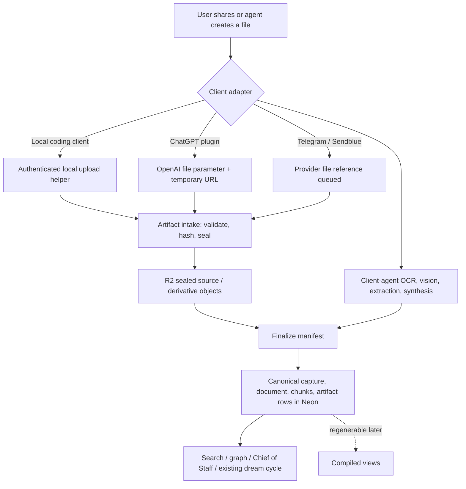

# HAETSAL governed artifact intake — implementation and validation plan

Date: 2026-08-13
Status: approved design direction; execution not started
Goal: make raw images/documents and intentionally created derivatives durable through the same governed HAETSAL capture path from Telegram, Codex, Claude Code, ChatGPT, and future clients.

## Requirements summary

Implement a shared artifact-intake capability with these non-negotiable outcomes:

1. A raw file shared for durable capture is retained in R2 and linked to its canonical capture in Neon/Postgres.
2. The client agent that can see the file performs the OCR, vision, document reading, and synthesis. HAETSAL persists that agent-produced searchable content; it does not require the cloud conversational agent to repeat the work.
3. Intentionally created output artifacts—reports, edited images, generated documents, diagrams, exports, and similar deliverables—are retained and linked. Scratch files, caches, and disposable test output are not artifacts.
4. Every client adapter converges on one HAETSAL-owned service contract. No vendor-specific brain, storage backend, or canonical write path is introduced.
5. The original and every durable derivative is application-layer sealed before it rests in R2. Neon remains the one searchable plaintext copy for extracted/normalized content, consistent with the existing single-user privacy decision.
6. The existing dream cycle remains unchanged in architecture: it reads canonical Neon memories and relationship summaries, not compiled wiki pages. Artifact intake must make extracted content canonical so the dream cycle can see it.
7. Compiled wiki/page refinement is out of scope. Compiled pages remain disposable projections that may be regenerated later.
8. The work is not done until local tests, adversarial security tests, real Codex/Claude and ChatGPT attachment flows, Telegram parity, production canaries, rollback proof, and a fresh final review all pass.

## Scope boundary

This plan covers interactive artifacts such as images, PDFs, office documents, text/Markdown, structured files, and agent-created deliverables. Set `ARTIFACT_MAX_BYTES` to a conservative tested default (25 MiB proposed) and reject larger interactive uploads with a stable `bulk_import_required` result.

Large archives such as a full Apple Health export belong to a separate bulk importer. That importer should later use the same artifact storage/finalization service, but it needs resumable/chunked ingestion and source-specific parsing; it must not be hidden inside an interactive MCP call.

## As-built baseline

The implementation should extend, not replace, these working foundations:

- `retainContent()` is the governed canonical write door: it deduplicates, applies write policy and salience, encrypts the archival body, and calls the canonical pipeline (`src/services/ingestion/retain.ts:10-72`).
- `captureThroughCanonicalPipeline()` writes canonical memory and then performs embeddings and optional downstream work (`src/services/canonical-capture-pipeline.ts:16-61`).
- Canonical truth is the Postgres repository selected by `getCanonicalMemoryStore()` (`src/services/canonical-postgres.ts:28-33`).
- The canonical artifact type already carries filename, media type, storage key, byte length, and SHA-256 (`src/types/canonical-memory.ts:8-18`).
- `canonical_artifacts` already lives beside captures/documents in Neon, but the active write model materializes only one artifact per capture (`src/services/canonical-postgres-base-ddl.ts:24-48`; `src/services/canonical-memory.ts:101-125`).
- `capture_memory` is already registered on the shared MCP surface and enters through `captureExternalClientMemory()` (`src/tools/canonical-memory.ts:38-41`; `src/services/external-client-memory-write.ts:10-38`).
- The current external-client artifact fields are reference metadata only; `artifact_ref` is normalized as an already stored R2 key and no bytes are uploaded (`src/tools/canonical-memory-schema.ts:3-18`; `src/services/external-client-memory.ts:86-121`).
- Delegated Codex/Claude credentials already resolve into Matt's existing tenant rather than a new machine brain (`src/middleware/cf-access.ts:29-71`; `src/middleware/auth.ts:81-85`).
- Telegram already fetches a photo, describes it, stores it, and queues a governed capture (`src/services/telegram-inbound.ts:88-113`; `src/workers/ingestion/media-handlers.ts:54-72`).
- The dream stage reads recent canonical memories and canonical relationship summaries; its report and proposals land back in canonical stores (`src/services/dream/stage.ts:30-68`; `src/services/dream/report.ts:1-80`; `src/services/dream/proposals.ts:1-120`).

## Confirmed gaps

1. `capture_memory` can point at an artifact but cannot receive, verify, seal, or upload its bytes (`src/tools/canonical-memory-schema.ts:3-18`; `src/services/external-client-memory.ts:91-99`).
2. The model is effectively one primary artifact per capture even though a capture may need one source plus several derivatives (`src/types/canonical-capture-pipeline.ts:44-56`; `src/services/canonical-memory-types.ts:15-33`).
3. `storage_kind` is inferred from whether inline encrypted content was supplied. A `stored_r2` reference can therefore be recorded as `reference` even when HAETSAL owns the R2 object (`src/services/canonical-memory.ts:69-71`).
4. Telegram and Sendblue write raw media bytes directly to R2 before governance/finalization (`src/services/telegram-inbound.ts:88-106`; `src/services/sendblue-inbound.ts:47-76`). This conflicts with the documented sealed-R2 posture (`docs/guide/07-security.md:22-31`).
5. If canonical dedup or finalization fails after those current raw writes, the object can be orphaned because upload and capture do not share an idempotent lifecycle (`src/services/ingestion/retain.ts:26-31`; `src/services/telegram-inbound.ts:95-106`).
6. No portable client workflow exists for a coding agent to upload local bytes and then finalize the canonical capture.
7. There is no real production artifact canary. The existing full demo treats photo intake as prior mechanism evidence rather than re-exercising the flow (`scripts/mission-phase13-full-demo.ts:128-130`).

## Architecture decisions

### One core, thin adapters

Build one `artifact-intake` service that owns validation, sealing, R2 keying, idempotency, lifecycle state, canonical finalization, derivative relationships, and receipts. Telegram, local coding-agent helpers, and ChatGPT file parameters are adapters over it.

Do not put vision/OCR/model calls inside the core service. The adapter supplies:

- the raw file or a short-lived authorized download URL;
- the client-produced extraction/normalized content;
- provenance and client/model identity;
- a manifest describing source and derivative artifacts.

### Two-phase lifecycle

Use a two-phase protocol because bytes must land before the canonical capture can reference them:

1. **Reserve and seal**: create an idempotent upload operation, validate bounded input, compute plaintext SHA-256, seal bytes, and write the object to its final tenant-scoped R2 key.
2. **Finalize**: atomically write one canonical capture/document plus one or more artifact rows/relations, then mark the upload operation complete.

Pending operations are metadata-only and expire. A scheduled orphan reaper deletes only expired, unfinalized encrypted objects after proving their exact tenant-scoped keys.

### Encryption posture

Preserve the previously chosen single-user model:

- Do not claim vendor blindness. Extracted text and chunks remain searchable plaintext in Neon.
- Keep plaintext out of D1, KV, Analytics, AI Gateway, queue metadata, and logs.
- Seal authenticated client uploads with the active TMK.
- Seal webhook/channel uploads with the valid Cron KEK; if no key is available, defer/fail honestly rather than writing plaintext.
- Reuse the existing `TMK1:` / `KEK1:` family convention with a binary-safe envelope and loud cross-family failure (`docs/guide/07-security.md:33-47`; `docs/lessons/phase-13-ops-runbook.md:44-56`).

### Source and derivatives

One capture may have:

- zero or one `source` artifact;
- zero or more `derivative` artifacts;
- a required parent link for each derivative when a source or earlier derivative exists;
- one explicit `primary` artifact for backward-compatible document views.

At least one artifact is required for `capture_mode=artifact`. A derivative declared in the finalize manifest must already be sealed successfully; finalization fails rather than silently dropping it.

### Client-specific byte transport

- **Codex/Claude/local coding clients**: use a local helper that can read an explicit filesystem path, stream it over the authenticated HAETSAL upload endpoint, and return an upload/artifact receipt. The agent then calls the canonical finalize tool with its extraction and manifest. Do not send large base64 blobs in model-visible MCP arguments.
- **ChatGPT hosted plugin**: expose a tool with `_meta["openai/fileParams"]`; ChatGPT supplies `download_url`, `file_id`, optional MIME, and filename. HAETSAL downloads through a strict SSRF-safe policy, seals the bytes, and finalizes with the model-supplied extraction. The official file-input contract is documented at <https://developers.openai.com/plugins/reference.md#define-file-inputs>.
- **Telegram/Sendblue**: enqueue provider file identifiers/URLs and metadata first; the queue-side adapter fetches, extracts, seals, and finalizes through the same core. A success reply is sent only after finalization.
- **Clients that expose context but not bytes/path/file parameters**: return `raw_bytes_unavailable`; do not create a pointer pretending the original was retained.

## Target flow



## Planned contracts

### Core domain types

Add `src/types/artifact-intake.ts` with explicit types for:

- `ArtifactRole = 'source' | 'derivative'`;
- `ArtifactStorageKind = 'managed_r2' | 'external_reference'`;
- `ArtifactEncryptionFamily = 'tmk' | 'kek' | 'legacy_unsealed'`;
- upload state: `reserved | sealed | finalized | failed | expired`;
- `ArtifactManifestEntry` with upload id, role, parent upload/artifact id, filename, declared/detected MIME, byte length, plaintext SHA-256, and optional client file id;
- finalize input with searchable `content`, title, scope, provenance, client/model identity, source ref, idempotency key, and artifact manifest;
- content-free status/error codes.

Keep `CanonicalArtifactRef` backward compatible for existing external references (`src/types/canonical-memory.ts:8-18`). Managed uploads should use artifact IDs/upload receipts, not caller-supplied arbitrary R2 keys.

### Operational upload ledger

Add the next D1 migration (currently expected as `migrations/1030_artifact_intake_operations.sql`) for a metadata-only `artifact_intake_operations` table:

- tenant id + operation/upload id;
- SHA-256 of the idempotency key, never the raw key;
- status and fixed-vocabulary error code;
- artifact id and exact tenant-scoped R2 key;
- declared/detected MIME category, byte length, plaintext/ciphertext hashes;
- encryption family, created/updated/expiry timestamps;
- canonical capture/document/operation IDs after finalize;
- unique `(tenant_id, idempotency_hash)` and tenant/status/expiry indexes.

Do not store filename, extracted content, temporary source URL, caption, or model prompt in D1.

### Canonical artifact manifest

Evolve the idempotent Postgres DDL in `src/services/canonical-postgres-base-ddl.ts:24-48` and the repository write transaction in `src/services/canonical-postgres-repository.ts:590-634`:

- allow the canonical write input to carry `artifacts[]` rather than one artifact;
- add `role`, `parent_artifact_id`, `encryption_family`, and `cipher_sha256` to `canonical_artifacts`;
- preserve `canonical_captures.artifact_id` and `canonical_documents.artifact_id` as the primary-artifact compatibility pointer;
- enforce same-tenant capture/artifact relations in application validation and repository queries;
- return an artifact manifest from `get_document`, with externally safe IDs/roles/hashes/status and without issuing public R2 URLs.

Update `src/types/canonical-capture-pipeline.ts:8-30`, `src/services/canonical-memory-types.ts:15-33`, `src/services/canonical-memory.ts:50-176`, and the in-memory/Postgres repository parity together.

### Service modules

Create a small service family rather than growing `canonical-memory-artifacts.ts` into an intake controller:

- `src/services/artifact-intake/contract.ts` — normalization and invariant checks;
- `src/services/artifact-intake/crypto.ts` — byte sealing/unsealing, family tags, hashes;
- `src/services/artifact-intake/download-policy.ts` — HTTPS-only URL/redirect/private-address controls and byte limits;
- `src/services/artifact-intake/operations.ts` — D1 metadata ledger and idempotency;
- `src/services/artifact-intake/storage.ts` — deterministic R2 keys, write/head/read/delete proof;
- `src/services/artifact-intake/finalize.ts` — canonical capture + multi-artifact transaction;
- `src/services/artifact-intake/reaper.ts` — expired pending-object cleanup.

Refactor `src/services/canonical-memory-artifacts.ts:14-64` so archival document bodies remain its responsibility while managed raw/derivative bytes use the intake service.

### Public/authenticated surfaces

Add:

- `reserve_artifact_upload` MCP tool: metadata/idempotency reservation for local clients;
- authenticated `PUT /api/artifacts/:uploadId/content`: exact reserved upload, bounded body, active tenant key required;
- `finalize_artifact_capture` MCP tool: searchable content plus sealed manifest;
- `capture_artifact_file` MCP/plugin tool: hosted file-parameter adapter for ChatGPT;
- `artifact_intake_status` MCP tool: content-free state and canonical IDs.

Register them beside the existing brain-memory tools (`src/tools/brain-memory-surface.ts:4-29`; `src/workers/mcpagent/do/register-tools.ts:95-125`). Keep `capture_memory` backward compatible for explicit/session-summary/reference-linked captures. Mark new write tools accurately (`readOnlyHint: false`, `destructiveHint: false`, `openWorldHint: false`) and authorize every call server-side.

### Local client helper

Source a portable helper in the repository (proposed `scripts/haetsal-artifact-upload.ts`) and install/repair it through the existing secret-free bridge scripts (`scripts/repair-haetsal-mcp.ps1:74-112`; `scripts/repair-claude-haetsal-mcp.ps1:60-104`). It must:

- require an explicit path and never expand broad globs/directories implicitly;
- compute size/hash locally and send no bytes to stdout/logs;
- use each client's existing delegated credentials without embedding them in config or arguments;
- reserve, upload, poll, and return a concise JSON receipt;
- support `--dry-run` and refuse files over the server-advertised limit;
- never perform extraction—the calling coding agent owns that work.

Add client instructions so Codex/Claude know: inspect file, upload original, create extraction/capture, upload every intentional derivative, finalize, and verify the receipt. Do this only after the tools are deployed so global instructions never demand unavailable behavior.

## Execution sessions

Each session should work on a dedicated `codex/` branch or an explicitly coordinated shared branch, start by reading this plan and HAETSAL memory, preserve unrelated dirty-worktree changes, and end with tests plus a HAETSAL closeout card.

### Session 1 — contract, threat model, and executable test skeleton

Deliverables:

1. Record an ADR/spec for the decisions above, including the single-user encryption boundary and the explicit non-goal of vendor blindness.
2. Build the client capability matrix with live proofs:
   - Codex Desktop/local path or plugin file-field availability;
   - Claude Code local path + helper;
   - ChatGPT developer-mode file parameter shape;
   - Telegram provider file-reference lifecycle.
3. Add domain schemas and failing contract/security tests before implementation.
4. Fix the default size, MIME behavior, URL allow policy, timeout, and expiry constants in one config module.

Exit gate:

- No unresolved client can silently drop raw bytes.
- ChatGPT file descriptor passes the official four-field schema and `_meta["openai/fileParams"]` requirements.
- Tests fail for missing source bytes, missing declared derivatives, tenant mismatch, MIME mismatch policy, oversize payload, SSRF/private URL, and missing encryption key.

### Session 2 — managed storage, crypto, idempotency, and canonical manifest

Deliverables:

1. Add the D1 operational migration and Postgres additive schema evolution.
2. Implement binary sealing, deterministic tenant-scoped keys, plain/cipher hashes, and loud key-family errors.
3. Implement reserve/upload/status/reaper behavior.
4. Extend canonical capture/repository code for multiple artifacts and primary-pointer compatibility.
5. Add failure-injection tests for R2 write, Neon transaction, retry, duplicate finalize, and orphan cleanup.

Exit gate:

- R2 objects contain no recognizable plaintext fixture bytes.
- D1/queues/log captures contain no filename, URL, extraction, caption, or file body.
- Repeating the same idempotency key returns the same operation/capture and does not create another R2 object.
- A capture with one source and two derivatives round-trips through Postgres and `get_document` with correct parent relationships.
- Cross-tenant read/finalize/status attempts return not-found/unauthorized without revealing existence.

### Session 3 — MCP and local coding-agent flow

Deliverables:

1. Register reserve/finalize/status tools and authenticated upload route.
2. Build the local upload helper and add repair/install checks.
3. Add/update Codex and Claude client instructions after live tool discovery succeeds.
4. Run real local E2E tests with:
   - one image requiring vision extraction;
   - one PDF/document requiring text extraction;
   - one agent-created derivative artifact.

Exit gate:

- From a fresh Codex task, sharing/identifying a local file results in a managed R2 object, canonical extraction, artifact manifest, search hit, and status receipt.
- The same passes from Claude Code using its distinct delegated credential.
- Both clients land in the same human tenant while receipts preserve distinct `client_name`/agent identity.
- An intentional derivative cannot be omitted from the manifest in the documented workflow.

### Session 4 — ChatGPT hosted attachment flow

Deliverables:

1. Add `capture_artifact_file` using the official OpenAI file-parameter descriptor.
2. Implement temporary-URL download with strict scheme, redirect, hostname/IP, timeout, length, and content sniffing controls.
3. Connect HAETSAL as a private ChatGPT plugin in developer mode with existing auth boundaries; add UI only if the direct tool flow cannot reliably bind an attached file.
4. Test direct, indirect, invalid, unauthorized, oversize, expired-URL, and out-of-scope prompts inside ChatGPT.

Exit gate:

- A file attached in ChatGPT—not merely a pasted summary—produces the same managed artifact/canonical receipt as Codex.
- The model-supplied extraction is searchable and cites the canonical source/capture.
- The temporary OpenAI URL and file ID do not persist outside the canonical provenance fields explicitly approved for retention; no URL appears in logs or D1.
- If ChatGPT does not pass bytes for a given surface, the user sees `raw_bytes_unavailable`; the flow is not counted as done until the supported ChatGPT surface passes.

### Session 5 — Telegram/Sendblue convergence and legacy raw-object remediation

Deliverables:

1. Move provider fetch/seal/finalize behind the common intake service.
2. Stop writing raw plaintext bytes in `src/services/telegram-inbound.ts:88-106` and `src/services/sendblue-inbound.ts:47-76`.
3. Preserve quick webhook acknowledgement by queueing provider metadata; send “captured” only after canonical finalization.
4. Add durable media reply idempotency equivalent to the text chat path.
5. Build a dry-run inventory for legacy unsealed `telegram-media/` and `sendblue-media/` objects plus unreferenced orphans.
6. With explicit production approval during execution, copy each referenced legacy object to a sealed canonical key, verify decrypt/hash, transactionally update Neon, and only then delete the old plaintext object. Delete proven orphans separately and record counts, never names/content.

Exit gate:

- Telegram and Sendblue channel tests exercise the shared service, not mocked legacy direct R2 puts.
- A real Telegram photo reaches sealed R2 + canonical extraction + search and returns exactly one success reply under retry.
- Dry-run inventory count equals migrated + explicitly skipped/failed count.
- No referenced plaintext legacy object is deleted before sealed-copy and Neon-pointer proof.

### Session 6 — observability, dream-cycle proof, canary, and documentation

Deliverables:

1. Add content-free metrics/events for reserved, sealed, finalized, failed, expired, and reaped operations.
2. Add an artifact canary that writes a tiny generated fixture through the production surface and verifies R2 head/hash, canonical manifest, search marker, and tenant isolation without logging content.
3. Prove the existing dream cycle consumes the canonical extraction by running a bounded test/manual dream input that includes the artifact capture. Do not make compiled pages a dependency.
4. Update the feeding/security/client runbooks to describe actual behavior, limits, error states, and recovery.
5. Add an operator runbook for stuck uploads, expired operations, orphan proof, legacy remediation, key-family failure, and rollback.

Exit gate:

- Dream-cycle proof comes from the canonical capture/document path.
- Compiled-page tests are unchanged except for any incidental fixture updates; no compiler/wiki feature is added.
- Canary output is metadata-only and can distinguish upload, seal, finalize, query, and cleanup failures.

### Session 7 — production rollout and evidence pack

Deliverables:

1. Create a rollback tag/version before deployment.
2. Deploy additive schema/core code behind `ARTIFACT_INTAKE_V1=false`; run schema and health checks.
3. Enable for a smoke tenant/client, then Matt's delegated coding clients, then ChatGPT, then Telegram/Sendblue.
4. Run the complete unit/integration suite and all live artifact E2Es.
5. Observe at least one scheduled canary interval plus an on-demand canary.
6. Produce a deployment memo with commit, Worker version, migration IDs, R2/Neon/D1 proof counts, tool descriptors, test commands/results, live capture IDs, canary run IDs, known limitations, and exact rollback command/version.

Exit gate:

- Every acceptance criterion below is evidenced, not inferred.
- Feature-flag rollback is proven without schema reversal or loss of already finalized artifacts.
- No plaintext raw artifact remains in newly written R2 objects.
- The implementation session hands this originating task the evidence pack for independent confirmation.

## Test plan

### Unit

- Byte seal/unseal for TMK and KEK; wrong-family and tamper failures.
- Plaintext/ciphertext SHA-256 and deterministic key formatting.
- Filename normalization without logging/storing it in D1.
- Declared versus detected MIME behavior.
- Size, timeout, content-length, redirect-count, and streaming abort limits.
- URL policy: HTTPS only, no credentials, no loopback/private/link-local/metadata IP, DNS-rebinding-safe resolution, and revalidation after redirects.
- Manifest rules: one source maximum, multiple derivatives, required parent, stable primary selection.
- Stable fixed-vocabulary errors with no user content.

### Integration

- Reserve → upload → finalize → status happy path.
- Same idempotency key retry at every transition.
- R2 success/Neon failure, Neon success/status failure, queue retry, and expired-operation cleanup.
- One capture with source plus multiple derivatives.
- Existing reference-only `capture_memory` compatibility (`tests/9.4-brain-memory-external-client-rollout.test.ts:67-127`).
- Canonical encrypted artifact and metadata-only queue behavior (`tests/6.3-canonical-capture-pipeline.test.ts:128-163`).
- Tenant A cannot read/finalize Tenant B upload, artifact, capture, or status.
- Search/recent/document/status surfaces preserve provenance and expose safe artifact manifests.
- Dream stage receives the canonical extracted body, never raw R2 bytes.

### Client E2E

- Codex image, document, and generated derivative.
- Claude Code equivalent with independent credential.
- ChatGPT attached file using official file params.
- Telegram real photo and duplicate-update retry.
- Unsupported/oversize file produces actionable, stable failure without partial canonical capture.

### Security and privacy

- R2 fixture scan finds ciphertext, not known plaintext signatures.
- D1 schema/data scan finds only permitted metadata.
- Captured logs contain no body, extraction, filename, temporary URL, file ID, caption, token, or key bytes.
- Queue payload inspection contains provider locators only until the key-bearing worker fetches the bytes; no raw body.
- SSRF suite covers redirect and DNS/IP tricks.
- Cross-tenant and unknown delegated-client tests fail closed.
- Tool annotations and auth are checked through MCP Inspector and ChatGPT developer mode.
- Legacy cleanup is dry-run-first, target-exact, hash-verified, and recoverable until the final delete gate.

### Regression and repository gates

Run focused tests after each session, then at release:

```powershell
npm test -- tests/6.3-canonical-capture-pipeline.test.ts
npm test -- tests/9.4-brain-memory-external-client-rollout.test.ts
npm test -- tests/mission-4.0-sendblue-channel.test.ts tests/mission-4.1-telegram-channel.test.ts
npm test -- tests/mission-13.0-hardening.test.ts
npm test
npm run checkout
```

Add new focused suites for contract/crypto, repository manifest, upload lifecycle, MCP adapters, ChatGPT file params, channel convergence, and security. `npm run checkout` remains the final repository gate (`package.json:6-14`; `docs/lessons/phase-13-prod-deploy-memo.md:33-46`).

## Acceptance criteria

- [ ] An authenticated coding client can retain a local raw image/document in R2 without embedding its bytes in a model-visible tool argument.
- [ ] ChatGPT can pass an attached file through the official file-parameter contract and receive a canonical receipt.
- [ ] Telegram and Sendblue use the same core service.
- [ ] Every new raw/derivative R2 object is family-tagged application ciphertext.
- [ ] The R2 key is tenant-scoped and recorded in the canonical artifact row; external tool results expose stable artifact IDs rather than public object URLs.
- [ ] A canonical capture contains client-produced searchable extraction/normalized content and provenance linking it to the raw artifact.
- [ ] One capture supports a source plus multiple derivatives with parent relationships.
- [ ] Every derivative declared by the client is mandatory for finalization.
- [ ] Existing explicit and session-summary `capture_memory` flows remain compatible.
- [ ] Duplicate/retried operations are idempotent across R2, D1, and Neon.
- [ ] Failed/expired operations leave no unbounded orphan accumulation.
- [ ] D1, queues, logs, Analytics, and AI Gateway remain free of raw artifact/extraction content.
- [ ] Cross-tenant access fails closed in unit, integration, and production smoke tests.
- [ ] The existing dream cycle sees the canonical extraction without reading compiled pages or raw R2 bytes.
- [ ] No wiki/compiler feature work is included.
- [ ] Legacy unsealed channel objects are inventoried; referenced objects are migrated with copy/verify/update/delete discipline and orphans are handled separately.
- [ ] Real Codex, Claude Code, ChatGPT, and Telegram E2E evidence exists.
- [ ] Production canary and rollback are proven.
- [ ] A fresh-context reviewer verifies source, tests, live evidence, privacy claims, and residual gaps before status becomes `shipped`.

## Risks and mitigations

| Risk | Mitigation / proof |
|---|---|
| Host gives the model visual context but not raw bytes | Capability matrix first; use OpenAI file params, local helper, or fail honestly with `raw_bytes_unavailable`. |
| Temporary hosted-file URL becomes an SSRF/exfiltration surface | Strict HTTPS/redirect/IP policy, byte/time limits, no persistence of URL, adversarial tests. |
| WebCrypto buffering causes memory pressure | Conservative interactive size limit; reject to bulk-import lane; do not base64 through MCP. |
| R2 succeeds but canonical write fails | Idempotent pending ledger, final stable key, retryable finalize, TTL reaper. |
| Multiple artifacts break old one-artifact reads | Keep primary pointer, add manifest additively, run old fixtures unchanged. |
| Telegram loses fast acknowledgement | Queue provider locator immediately; perform fetch/seal/finalize asynchronously; reply only on durable result. |
| No KEK is available for webhook media | Defer/retry and notify honestly; never fall back to plaintext. |
| Agent forgets an output derivative | Client instructions require a manifest and receipt verification; E2E tests cover created derivatives; server refuses declared-but-unsealed entries. |
| Legacy plaintext remediation deletes the wrong object | Dry-run inventory, exact keys, sealed copy, decrypt/hash proof, transactional pointer update, delayed old-key deletion. |
| Scope drifts into wiki or multi-user redesign | Explicit non-goals; compiler untouched; single-user crypto posture preserved while tenant tests remain. |

## Final validation in the originating task

After the execution sessions finish, return here with the deployment evidence pack. The final confirmation pass must be independent of the implementation summaries and should:

1. Read the actual diff and schema evolution, not only the deployment memo.
2. Re-run the focused suites and `npm run checkout` from the release commit.
3. Inspect MCP tool schemas/annotations and the installed client instructions.
4. Re-run one new local coding-agent artifact and one ChatGPT attachment with unique markers.
5. Re-run one Telegram photo or, if Matt does not want to send one during validation, explicitly leave Telegram live proof unconfirmed rather than substituting a mock.
6. Inspect production status/canary receipts, Neon artifact manifest rows, D1 metadata-only rows, and R2 object headers/hashes through authorized tooling.
7. Search for the extraction marker through canonical retrieval and confirm the artifact lineage.
8. Trigger/bound the dream-cycle proof and confirm it uses the canonical extraction.
9. Verify no compiled-page dependency was added.
10. Review rollback instructions and either execute a safe feature-flag rollback drill or prove the previously recorded drill is for the exact deployed version.
11. Record one final HAETSAL memory card as `shipped`, `verified`, or `blocked` with commit/deploy/capture/canary evidence and remaining open loops.

The final answer should say **shipped and verified** only if every non-optional acceptance criterion has direct evidence. Anything missing must be named precisely as a residual gap.

## Suggested prompts for the execution sessions

Use this common prefix:

> Implement Session N from `.omx/plans/2026-08-13-haetsal-governed-artifact-intake-plan.md`. Start with HAETSAL memory and current source truth. Preserve unrelated working-tree changes. Stay within the session boundary, add the specified tests, run its exit gate, and capture an evidence-grade HAETSAL closeout card. Do not work on compiled wiki features or multi-user redesign.

For the deployment session add:

> Do not declare completion from local tests alone. Produce the complete production evidence pack and hand it back to the originating planning task for independent final validation.
