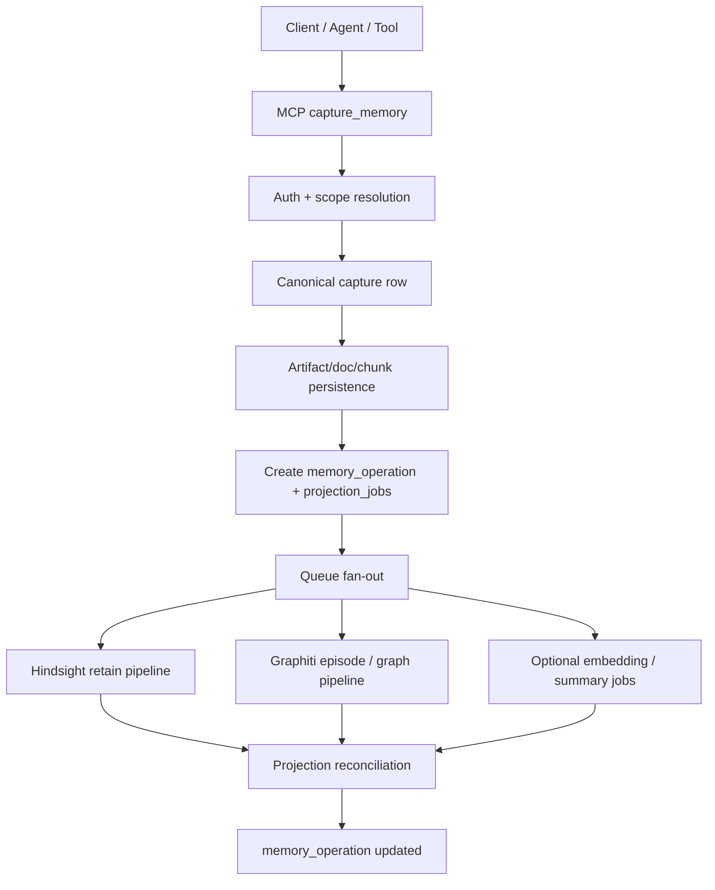

# Advanced Open Brain Architecture

Date: 2026-04-17
Status: Draft architecture target
Scope: Clean-sheet target for the long-term HAETSAL memory foundation

## Purpose

Define the target architecture for an advanced open brain that:

- stays portable across AI tools
- keeps its source of truth outside any single vendor runtime
- supports richer semantic memory than a plain vector database
- supports graph- and time-aware memory behavior
- uses Cloudflare as the orchestration and runtime shell

This document is intentionally more foundational than the current production
architecture. It is not a statement that HAETSAL should be rewritten. It is the
target against which future phases should be judged.

## Product Thesis

HAETSAL's long-term memory system is not "chat memory" and not "tool-local
memory". It is an external second brain / open brain that should become:

- a canonical memory layer for Matt
- portable across Claude, ChatGPT, Gemini, Codex, Cursor, and future clients
- usable by first-party HAETSAL agents such as chief-of-staff, research,
  planning, and action agents
- richer than a notes database by supporting extraction, semantic recall,
  reflection, and relationship evolution over time

## Design Principles

1. The canonical brain is external and portable.
2. MCP is the universal read/write interface.
3. Raw capture, semantic memory, graph memory, and session memory are distinct.
4. Every write enters the system once, then fans out into projections.
5. No AI client owns the canonical memory substrate.
6. Hindsight and Graphiti are advanced memory engines, not the only source of
   truth.
7. Cloudflare is the runtime and orchestration shell, not the sole memory
   substrate.

## Canonical Foundation

The canonical foundation is:

- Postgres for structured source-of-truth records
- R2 for large raw artifacts and archives
- MCP as the universal interface

### Why Postgres

Postgres is the best canonical substrate for this system because it supports:

- relational structure for provenance, scope, permissions, and operations
- vector extensions such as `pgvector`
- portability and inspectability
- compatibility with Hindsight and future graph projections

D1 remains useful for Cloudflare-local control-plane or operational state, but
it is not the preferred canonical brain substrate for the advanced end state.

R2 remains useful for raw artifact storage, but it is not the canonical store
for transactional memory state.

## Memory Layers

The system has four distinct memory layers.

### 1. Canonical Raw Memory

Stores what actually happened.

- raw transcripts
- imported conversations
- notes
- emails
- files
- screenshots
- browser captures
- agent outputs

Canonical records:

- `captures`
- `artifacts`
- `documents`
- `chunks`

### 2. Semantic Memory

Stores what the system can recall and synthesize semantically.

Primary engine:

- Hindsight

Responsibilities:

- retain
- recall
- reflect
- consolidation
- semantic memory evolution

### 3. Graph / Temporal Memory

Stores how entities and relationships evolve over time.

Primary engine:

- Graphiti

Responsibilities:

- episodes
- entities
- edges
- valid time / evolution over time
- point-in-time or timeline-style relationship queries

### 4. Session / Working Memory

Stores what one active agent needs in the moment.

Possible implementation:

- Cloudflare Sessions / Agent Memory

Responsibilities:

- conversation history
- local context blocks
- working summaries
- temporary caches

This layer is explicitly not canonical.

## Roles By System

### Postgres

Canonical source of truth for:

- provenance
- scopes
- access policy
- document/chunk registry
- operation state
- projection links

### R2

Canonical raw artifact shelf for:

- source files
- transcripts
- screenshots
- imported archives
- export bundles

### Hindsight

Semantic memory engine for:

- advanced recall
- reflection
- consolidation
- semantic pattern formation over time

### Graphiti

Temporal relationship engine for:

- graph projection
- entity evolution
- relationship history
- graph-native traversal and timeline reasoning

### Cloudflare

Runtime and orchestration shell for:

- MCP edge/API surface
- auth and policy
- queues
- workflows
- browser automation
- agents and DO-based coordination
- model routing
- memory pipeline operations

## Canonical Data Model

The canonical substrate should own, at minimum, these record families:

- `identities`
- `scopes`
- `sources`
- `captures`
- `artifacts`
- `documents`
- `chunks`
- `memory_operations`
- `projection_jobs`
- `projection_results`
- `access_policies`

### Required Properties

Every canonical memory item should be able to answer:

- where did this come from?
- who or what produced it?
- what scope does it belong to?
- what raw artifact or source backs it?
- what semantic memory projection was created from it?
- what graph projection was created from it?
- what async processing state is it in?

## Universal Interface

The public brain interface should be remote MCP.

### Core Tools

- `capture_memory`
- `search_memory`
- `get_recent_memories`
- `get_document`
- `get_scope_summary`
- `get_person_context`
- `get_project_context`
- `memory_status`
- `memory_stats`

### Advanced Tools

- `reflect_on_scope`
- `trace_relationship`
- `get_entity_timeline`
- `explain_memory`
- `prepare_context_for_agent`

The tool contract should remain stable even as the backing systems evolve.

## Write Path

Every write should follow one canonical pipeline.

### Write Rules

1. A client never writes only to Hindsight.
2. A client never writes only to Graphiti.
3. Canonical capture happens first.
4. Hindsight and Graphiti are projection targets fed from the same canonical
   event.

## Read Path

Reads should select the right memory mode rather than hitting every backend by
default.

### Read Modes

- raw mode
  - exact document/source lookup
- semantic mode
  - Hindsight-first
- graph mode
  - Graphiti-first
- composed mode
  - merge canonical metadata + semantic recall + graph context

### Query Examples

- "What do I know about X?"
  - semantic mode
- "How has my relationship with X changed over time?"
  - graph mode
- "Show me exactly what I said last Thursday."
  - raw mode
- "Prepare context for my chief-of-staff agent before a meeting."
  - composed mode

## Source-of-Truth Rules

These rules are mandatory for architectural coherence.

1. Raw capture truth lives in canonical Postgres + R2.
2. Hindsight is authoritative for semantic recall behavior, not raw provenance.
3. Graphiti is authoritative for graph/temporal projection behavior, not raw
   provenance.
4. Session memory is disposable and non-canonical.
5. Every Hindsight or Graphiti object must map back to canonical capture or
   document records.
6. No client should need to know whether an answer came from Hindsight,
   Graphiti, or canonical source unless explicitly asking for that distinction.

## Cloudflare Runtime Topology

### Workers

- public MCP/API surface
- auth and access policy
- request shaping

### Durable Objects

- live session coordination
- websocket coordination
- future agent runtime coordination

### Queues

- capture fan-out
- webhook ingestion
- background retries
- burst absorption

### Workflows

- bootstrap
- scheduled reflection
- background review
- recovery sequences
- multi-step durable processing

### AI Gateway

- model abstraction
- retries
- provider routing

### Browser Run

- browser capture
- action execution
- future agent-web interaction

### Containers

- Hindsight
- Graphiti if self-hosted in Cloudflare
- only for workloads that truly require Linux/service runtimes

## Phased Build Plan

### Phase 1 - Open Brain Foundation

- canonical Postgres schema
- R2 artifact shelf
- MCP surface
- capture/recent/search/source retrieval
- provenance and scopes
- operation log

### Phase 2 - Semantic Memory

- Hindsight fan-out
- semantic recall tools
- reflection/consolidation
- Hindsight operation truth and observability

### Phase 3 - Graph / Temporal Memory

- Graphiti fan-out
- graph projection
- entity timeline tools
- relationship traversal tools

### Phase 4 - Native HAETSAL Agents

- chief-of-staff agent
- planning/research/action agents
- shared open-brain foundation across all agents

### Phase 5 - Session Memory Optimization

- agent-local session memory
- local summaries and compaction caches
- Cloudflare-native working memory improvements

## Relationship To Current HAETSAL

Current HAETSAL already aligns with the target in several ways:

- MCP-first product surface
- Cloudflare runtime/orchestration shell
- Hindsight as semantic memory engine
- async lifecycle truth
- clear auth/access boundaries

Current HAETSAL does not yet fully embody the target because:

- the canonical open-brain foundation is not yet modeled independently from the
  current memory engine choices
- Graphiti is not yet integrated as a graph/temporal projection layer
- source-of-truth boundaries across raw, semantic, graph, and session memory
  are not yet fully codified in one place

## Key Risks

### 1. Role Confusion

If Postgres, Hindsight, Graphiti, and session memory all become competing
"brains", the system will become incoherent.

### 2. Leaky Projections

If clients write directly to Hindsight or Graphiti without canonical capture,
provenance and replayability degrade quickly.

### 3. Premature Complexity

Adding graph, semantic, and session memory at once without clear boundaries
creates duplicated retrieval semantics and inconsistent answers.

### 4. Product Drift

The system must remain "portable open brain first", not drift into becoming a
single-client chat memory system.

## Open Questions

1. Should Graphiti be self-hosted in Cloudflare Containers or run elsewhere at
   first?
2. Should the canonical vector layer live in Postgres only, or should a
   separate vector index be added for performance?
3. Which read modes are product-visible versus internal-only?
4. How much of the canonical schema should be user-inspectable from day one?
5. What is the first minimal chief-of-staff / personal-agent layer that proves
   the architecture?

## Summary

The target architecture is:

- OB1 principles for the foundation
- Postgres + R2 as the canonical substrate
- MCP as the universal interface
- Hindsight as the semantic memory engine
- Graphiti as the graph/temporal memory engine
- Cloudflare as the runtime and orchestration shell

This is the architectural target for the advanced open brain. It is not a claim
that all parts should be implemented immediately. It is the blueprint future
phases should be measured against.
