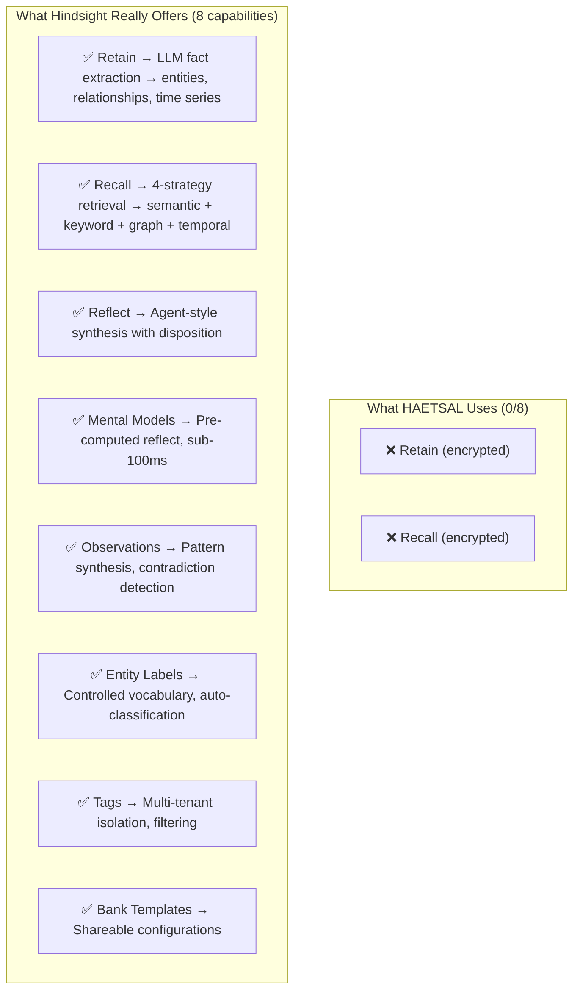

# Post-Mortem: Why HAETSAL's Hindsight Implementation Was Fundamentally Wrong

> [!CAUTION]
> This is an honest root-cause analysis, grounded in Hindsight's actual documentation (v0.5, April 2026), not inferred from Fold or any other project.

---

## TL;DR — The 7 Violations

| # | What HAETSAL Does | What Hindsight Actually Expects | Severity |
|---|---|---|---|
| 1 | Sends **encrypted ciphertext** as `content` | Requires **plaintext** — LLM extracts facts from it | 🔴 Fatal |
| 2 | Invented **custom API** (`/api/retain`, `/api/recall`) | Real API is `POST /{bank_id}/retain`, `POST /{bank_id}/recall` | 🔴 Fatal |
| 3 | Invented **custom type system** (`HindsightRetainRequest` with `content_encrypted`, `salience_tier`, `domain`) | Real API takes `content`, `context`, `tags`, `document_id`, `timestamp` | 🔴 Fatal |
| 4 | **No bank configuration** (no mission, no disposition, no entity labels) | Bank config is "the single biggest cause of low-quality memories" per docs | 🟡 Critical |
| 5 | **No `@vectorize-io/hindsight-client` SDK** — uses raw `fetch()` | Official TypeScript SDK exists with `retain()`, `recall()`, `reflect()` | 🟡 Critical |
| 6 | Container on **port 8080**, pinned to **v0.4.16-slim** | Hindsight serves on port **8888** (API) / **9999** (UI), latest is **v0.5.2** | 🟡 Critical |
| 7 | **No `reflect` tool** — the highest-value capability is entirely missing | Reflect is a first-class operation with structured output, mental models, tool traces | 🟡 Critical |

---

## Root Cause: Why Did This Happen?

### The Fundamental Mistake: We Never Read the Docs

The HAETSAL Hindsight integration was built by **imagining what Hindsight's API should look like** based on the name and concept, rather than reading the actual documentation. Every single file proves this:

#### Evidence 1: The Type System is Fabricated
```typescript
// What HAETSAL defined (src/types/hindsight.ts)
export interface HindsightRetainRequest {
  tenant_id: string
  content_encrypted: string   // ← THIS FIELD DOESN'T EXIST
  memory_type: 'episodic' | 'semantic' | 'procedural' | 'world'
  domain: string              // ← THIS FIELD DOESN'T EXIST
  provenance: string          // ← THIS FIELD DOESN'T EXIST
  salience_tier: number       // ← THIS FIELD DOESN'T EXIST
  occurred_at: number         // ← THIS FIELD DOESN'T EXIST
  metadata?: Record<string, unknown>
}
```

```typescript
// What Hindsight ACTUALLY accepts (from docs + SDK)
await client.retain('my-bank', 'Alice works at Google', {
  timestamp: new Date('2024-01-15'),
  context: 'career update',
  metadata: { source: 'slack' },
  tags: ['user:alice'],
  document_id: 'session-123',  // for upsert/dedup
  async: false,
});
```

- `content_encrypted` → not a thing. Hindsight expects `content` (plaintext string)
- `memory_type: 'episodic' | 'semantic' | 'procedural'` → Hindsight uses `world`, `experience`, `observation` — automatically classified by its LLM
- `domain`, `provenance`, `salience_tier` → completely invented fields. None exist in the API
- `occurred_at: number` → should be `timestamp` (ISO 8601 string)
- Missing: `bank_id` (path param), `context`, `tags`, `document_id`

#### Evidence 2: The API Routes are Fabricated  
```typescript
// What HAETSAL calls (src/services/ingestion/retain.ts:99)
getHindsightStub(tenantId, env).fetch('http://hindsight/api/retain', { ... })

// What HAETSAL calls (src/tools/recall.ts:52)
getHindsightStub(tenantId, env).fetch('http://hindsight/api/recall', { ... })
```

These routes don't exist. The real Hindsight API routes are:
- `POST /v1/default/banks/{bank_id}/retain` — Store memories
- `POST /v1/default/banks/{bank_id}/recall` — Search memories
- `POST /v1/default/banks/{bank_id}/reflect` — Generate synthesized answers
- `PUT /v1/default/banks/{bank_id}` — Create/update bank config

Our code hits 404s on every single call.

#### Evidence 3: The Recall Pipeline is Also Fabricated
```typescript
// HAETSAL encrypts the QUERY before sending (src/tools/recall.ts:50-62)
const queryEncrypted = await encryptQuery(input.query, tmk)
body: JSON.stringify({
  tenant_id: tenantId,
  query_encrypted: queryEncrypted,  // ← encrypted query??
  domain: input.domain,             // ← not a real param
  mode: input.mode ?? 'default',    // ← not a real param
  limit: input.limit ?? 10,         // ← wrong name (max_tokens)
})
```

The real Recall API:
```json
{
  "query": "What does Alice do?",  // PLAINTEXT. Always.
  "types": ["world", "experience"],
  "budget": "mid",
  "max_tokens": 4096,
  "tags": ["user:alice"],
  "tags_match": "any_strict"
}
```

Hindsight performs 4 retrieval strategies in parallel (semantic, keyword, graph, temporal), reranks with a cross-encoder model, and returns structured results with entities. None of that works on encrypted ciphertext.

#### Evidence 4: The Port is Wrong
```dockerfile
# HAETSAL Dockerfile
FROM ghcr.io/vectorize-io/hindsight:0.4.16-slim
EXPOSE 8080  # ← WRONG
```

```typescript
// HAETSAL Container DO
export class HindsightContainer extends Container {
  defaultPort = 8080  // ← WRONG
}
```

Hindsight serves on **port 8888** (API) and **9999** (UI). This is clearly stated in the README:
> API: http://localhost:8888 UI: http://localhost:9999

The container would start, bind to 8888, but our DO would try to route to 8080, getting connection refused.

---

## What We Were SUPPOSED To Do (Per Hindsight's Docs)

### 1. Use the Official TypeScript SDK
```bash
npm install @vectorize-io/hindsight-client
```

```typescript
import { HindsightClient } from '@vectorize-io/hindsight-client';
const client = new HindsightClient({ baseUrl: 'http://localhost:8888' });
```

### 2. Configure the Bank BEFORE Ingesting Data

> "Misconfigured missions are the single biggest cause of low-quality memories." — [Best Practices](https://hindsight.vectorize.io/best-practices)

```typescript
await client.createBank('haetsal-brain', {
  name: 'HAETSAL Life OS',
  mission: "You are a personal life operating system assistant...",
  retain_mission: "Extract personal preferences, commitments, deadlines, health info, and relationship details. Ignore filler phrases and pleasantries.",
  observations_mission: "Identify evolving preferences, recurring patterns, behavioral shifts...",
  reflect_mission: "You are a personal assistant who remembers everything important to the user...",
  disposition: {
    skepticism: 3,   // 1-5
    literalism: 3,
    empathy: 4,       // higher empathy for personal assistant
  },
});
```

### 3. Retain Plaintext with Rich Context
```typescript
await client.retain('haetsal-brain', conversationContent, {
  context: 'User conversation via Telegram about weekend planning',
  timestamp: new Date(),
  tags: ['user:matt', 'channel:telegram'],
  document_id: `session-${sessionId}`,  // stable ID for upsert!
});
```

### 4. Recall with Proper Filtering
```typescript
const results = await client.recall('haetsal-brain', 'What are my plans for this weekend?', {
  types: ['world', 'experience'],
  budget: 'mid',
  tags: ['user:matt'],
  tags_match: 'any_strict',
});
```

### 5. Reflect for Synthesis
```typescript
const answer = await client.reflect('haetsal-brain', 'What should I know before my meeting today?', {
  budget: 'mid',
  context: 'preparing for morning briefing',
});
console.log(answer.text);  // Rich markdown response grounded in memories
```

---

## LLM Provider: What Hindsight Actually Recommends

Hindsight has a **[Model Leaderboard](https://benchmarks.hindsight.vectorize.io/)** that benchmarks models across quality, speed, cost, and reliability for retain and reflect operations. **The previous version of this document recommended Gemini for retain and Anthropic for reflect — those recommendations were wrong.** They were based on general model reputation, NOT the leaderboard data.

### The Actual Leaderboard Rankings (from benchmarks.hindsight.vectorize.io)

#### Retain Leaderboard (Fact Extraction) — Top 5
| Rank | Model | Provider | Total | Quality | Speed | Cost |
|------|-------|----------|-------|---------|-------|------|
| **#1** | **`openai/gpt-oss-20b`** | **Groq** | **81.2** | 83.9 | 57.0 (7.5s) | 91.7 |
| #2 | `openai/gpt-oss-120b` | Groq | 79.7 | 84.7 | 55.4 (8.1s) | 84.7 |
| #3 | `gpt-4.1-nano` | OpenAI | 78.8 | 87.2 | 54.0 (8.5s) | 76.9 |
| #4 | `gemma4:31b` | Ollama Cloud | 76.0 | 86.0 | 26.3 (28s) | 100.0 |
| #5 | `gpt-5.4-nano` | OpenAI | 74.7 | 83.9 | 60.9 (6.4s) | 54.8 |

#### Reflect Leaderboard (Synthesis) — Top 5
| Rank | Model | Provider | Total | Quality | Speed | Cost |
|------|-------|----------|-------|---------|-------|------|
| **#1** | **`openai/gpt-oss-120b`** | **Groq** | **86.6** | 94.2% | 69.4 (2.2s) | 84.7 |
| #2 | `openai/gpt-oss-20b` | Groq | 86.3 | 94.2% | 64.3 (2.8s) | 91.7 |
| #3 | `gemini-2.5-flash-lite` | Google | 81.5 | 88.4% | 67.7 (2.4s) | 76.9 |
| #4 | `gpt-4o-mini` | OpenAI | 77.0 | 93.8% | 41.7 (7.0s) | 69.0 |
| #5 | `gpt-4.1-nano` | OpenAI | 74.5 | 80.2% | 59.5 (3.4s) | 76.9 |

> [!IMPORTANT]
> **Groq dominates both leaderboards.** The `openai/gpt-oss` models on Groq infrastructure outperform every other provider across the composite score. Hindsight's own configuration examples also mark Groq as `# Groq (recommended)`. This isn't a suggestion — it's the benchmarked winner.

#### Non-Viable Models (scored 0 on retain)
`gemma3:1b`, `gemma3:12b`, `qwen2.5:0.5b`, `qwen2.5:3b`, `smollm2:1.7b`, `gemma3:270m`, `deepseek-r1:1.5b`, `granite3.1-dense:2b`, `llama3.2:latest`, `ministral-3:3b`

### Per-Operation Override (Key Feature!)
Hindsight supports **different models for different operations**, which matters because retain (structured extraction) and reflect (synthesis) have different quality profiles:
```bash
# Global: Groq for fast, high-quality extraction
export HINDSIGHT_API_LLM_PROVIDER=groq
export HINDSIGHT_API_LLM_API_KEY=gsk_xxxxxxxxxxxx
export HINDSIGHT_API_LLM_MODEL=openai/gpt-oss-20b

# Override for Reflect: use the 120b model for higher-quality synthesis
export HINDSIGHT_API_REFLECT_LLM_PROVIDER=groq
export HINDSIGHT_API_REFLECT_LLM_MODEL=openai/gpt-oss-120b
```

### Model Requirements
- **Minimum 65,000 output tokens** for reliable fact extraction
- If your model supports less, set `HINDSIGHT_API_RETAIN_MAX_COMPLETION_TOKENS`

### Recommendation for HAETSAL (Based on Leaderboard, Not Guessing)

| Operation | Provider | Model | Why (Leaderboard Evidence) |
|-----------|----------|-------|---|
| **Retain** (fact extraction) | `groq` | `openai/gpt-oss-20b` | **#1 on retain leaderboard** — 81.2 composite, fast (7.5s), cheapest of top 3 (91.7 cost score) |
| **Reflect** (synthesis) | `groq` | `openai/gpt-oss-120b` | **#1 on reflect leaderboard** — 86.6 composite, 94.2% quality, 2.2s latency |
| **Fallback** (if no Groq) | `openai` | `gpt-4.1-nano` | #3 retain / #5 reflect — solid all-around if Groq is unavailable |

> [!NOTE]
> The previous recommendation of Gemini for retain was wrong — `gemini-2.5-flash` doesn't even appear in the retain top 5. The previous recommendation of Anthropic for reflect was wrong — no Anthropic model appears in the reflect top 5 either. The leaderboard is clear: **Groq wins both**.

---

## The Correct Architecture

### What Hindsight Actually Provides (that we're ignoring)



### Memory Architecture (from Hindsight docs)
Hindsight organizes memories into biomimetic structures:
- **World Facts** — "The stove gets hot" (factual knowledge)
- **Experiences** — "I touched the stove and it hurt" (agent's own history)  
- **Observations/Mental Models** — Synthesized understanding formed by reflecting on facts + experiences

Our current code tries to manually classify memories into `episodic | semantic | procedural` types — Hindsight does this automatically via LLM fact extraction. We were reinventing (badly) what Hindsight already does.

---

## Anti-Patterns We Hit (Per Hindsight Best Practices)

| Anti-Pattern | HAETSAL Status | Best Practice |
|---|---|---|
| "Retaining pre-encrypted content" | 🔴 We do this | "Pass the richest representation available. **Never pre-summarize.**" |
| "No `document_id`" | 🔴 We don't use it | "Use stable, meaningful IDs. Always use the same ID for a growing conversation" |
| "No `context` field" | 🔴 We don't set it | "High-impact on extraction quality. **Always set it.**" |
| "No `tags`" | 🔴 We don't use them | "Multi-tenant minimum: Every retain must include `user:<id>`" |
| "No bank mission" | 🔴 Not configured | "Misconfigured missions are the **single biggest cause of low-quality memories**" |
| "Budget always default" | 🟡 N/A (recall is broken) | "Default to `mid`. Use `low` for agent loops. Reserve `high` for deep recall" |
| "Retain and recall same turn" | 🟡 Possible in our flow | "Do not retain and recall in the same turn" |

---

## Honest Summary

We built a **fantasy integration** — an API client for a server that doesn't exist. The code compiles, the types are clean, the encrypt/decrypt pipeline is elegant... but it's talking to a made-up API. Every retain call hits 404. Every recall call hits 404. Even if it didn't, Hindsight would receive encrypted gibberish and extract zero facts from it.

The fix is not "adjust the encryption boundary." The fix is **start over from the Hindsight SDK** and actually call the real API:

1. `npm install @vectorize-io/hindsight-client`
2. Configure the bank with proper missions
3. Send plaintext content with `context`, `tags`, `document_id`, `timestamp`
4. Use `recall()` for retrieval, `reflect()` for synthesis
5. Keep R2 STONE encrypted for archival — that part was correct

The encryption question is secondary. The primary problem is we never talked to the real Hindsight.
