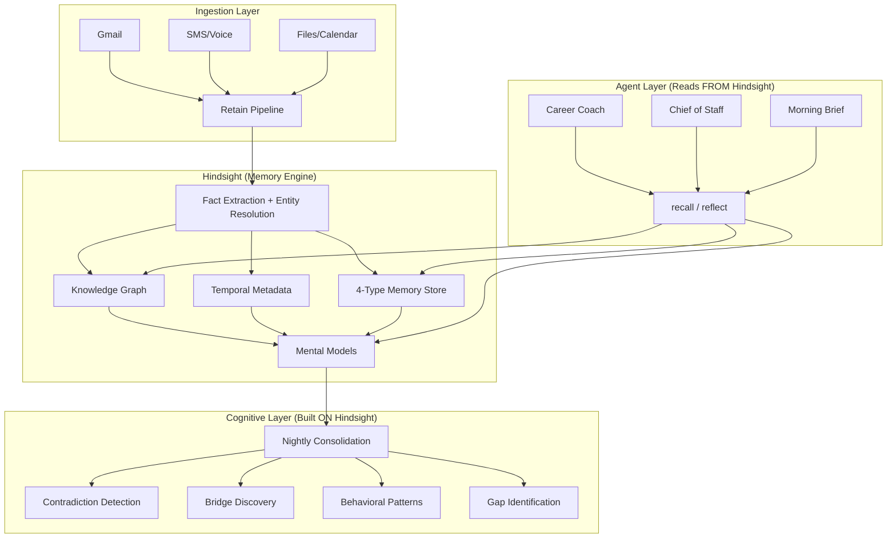

# Hindsight — What It Does & What It Enables for THE Brain

## What is Hindsight?

Hindsight is your **memory engine** — an independent service that runs inside a [Cloudflare Container](file:///c:/Users/matth/Documents/HAETSAL%20OS/src/workers/mcpagent/do/HindsightContainer.ts) and owns all knowledge storage, retrieval, and synthesis. It's the core of Layer 2 in the three-layer stack. If THE Brain were a human brain, Hindsight would be the hippocampus + neocortex — the organic processes that *form*, *store*, *retrieve*, and *integrate* memories.

> [!IMPORTANT]
> Hindsight is **never exposed to the public internet**. It's only reachable via Cloudflare's internal service binding from the Worker. All access flows through the [getHindsightStub()](file:///c:/Users/matth/Documents/HAETSAL%20OS/src/services/hindsight.ts) helper.

---

## The Three Core Operations

Hindsight provides three fundamental operations, each called by the Worker/agents but executed inside the container:

### 1. **Retain** — Writing Memories

When any data enters THE Brain (email, SMS, file upload, calendar event, agent conversation), it flows through [retainContent()](file:///c:/Users/matth/Documents/HAETSAL%20OS/src/services/ingestion/retain.ts) — the single write path for all memory. The pipeline:

```
Raw Content
  → Dedup check (skip if already seen)
  → Write policy validation (Law 3 gate)
  → Salience scoring (Tier 1/2/3)
  → Domain inference (career, health, relationships, etc.)
  → AES-256-GCM encryption with Tenant Master Key
  → R2 STONE archive (raw encrypted backup)
  → Hindsight retain API call
  → D1 audit batch (ingestion_events + memory_audit)
```

What Hindsight does internally on retain:
- **Fact extraction** — pulls typed facts from the content (depth scales with salience tier)
- **Entity resolution** — identifies people, projects, concepts and links them to existing entities
- **Temporal tagging** — records *when* facts were true
- **Knowledge graph integration** — links new facts to existing knowledge

### 2. **Recall** — Retrieving Memories

When an agent needs information, [recallViaService()](file:///c:/Users/matth/Documents/HAETSAL%20OS/src/tools/recall.ts) sends an encrypted query to Hindsight. Hindsight runs **4-way parallel retrieval**:

| Retrieval Method | What It Finds |
|---|---|
| Semantic search | Meaning-similar memories (vector similarity) |
| BM25 | Keyword-matched memories (traditional search) |
| Graph traversal | Memories connected via entity relationships |
| Temporal | Memories relevant to a specific time context |

Results come back with **confidence and relevance scores** per memory, which get propagated to agent responses. Low confidence → the agent hedges ("I think... but I'm not sure").

Two special recall modes:
- **`mode: timeline`** — returns the evolution of thinking on a topic over time
- **Cross-domain** — returns synthesized bridges between two life domains

### 3. **Reflect** — Synthesized Answers

Used by [pass4-gaps.ts](file:///c:/Users/matth/Documents/HAETSAL%20OS/src/cron/passes/pass4-gaps.ts) and agents for higher-order queries. Rather than returning raw memories, Hindsight's reflect endpoint runs an LLM synthesis *over* retrieved memories and returns a structured answer. This powers things like gap discovery and the morning brief.

---

## The Four Memory Types

Every memory in Hindsight is typed. This is defined in the [HindsightRetainRequest](file:///c:/Users/matth/Documents/HAETSAL%20OS/src/types/hindsight.ts):

| Type | What It Stores | Example |
|---|---|---|
| `episodic` | Specific events and experiences | "Had a tense 1:1 with manager about Q3 goals" |
| `semantic` | Durable facts and knowledge | "Matt's manager is Sarah Chen" |
| `procedural` | Behavioral patterns (how you operate) | "Direct accountability framing works better than encouragement when Matt is stuck" |
| `world` | External knowledge and context | "Cloudflare Workers have a 128MB memory limit" |

> [!IMPORTANT]
> **Procedural memory is write-protected.** Only the nightly consolidation cron ([pass3-patterns.ts](file:///c:/Users/matth/Documents/HAETSAL%20OS/src/cron/passes/pass3-patterns.ts)) can write procedural memories. Agents cannot — the write policy validator blocks it. This prevents agents from accidentally shaping their own behavior.

---

## Mental Models — Living Summaries

During bootstrap, Hindsight is configured with **6 mental models** via [hindsight-config.ts](file:///c:/Users/matth/Documents/HAETSAL%20OS/src/services/bootstrap/hindsight-config.ts):

| Domain | Focus |
|---|---|
| Career & Professional | Role, ambitions, key relationships, decisions |
| Health & Wellness | Routines, goals, challenges, trajectory |
| Relationships & Social | Key people, dynamics, quality |
| Learning & Growth | Active learning, curiosity, skills |
| Financial | Goals, constraints, trajectory |
| General & Cross-Domain | Core values, life philosophy, recurring tensions |

These are **auto-updating** — the `trigger: { refresh_after_consolidation: true }` setting tells Hindsight to regenerate each mental model after every consolidation run. This means the brain's understanding of you continuously improves without manual intervention.

Agents load relevant mental models into their context at session start, giving them an up-to-date "state of you" without needing to recall individual memories.

---

## Nightly Consolidation — The "Sleep" Pass

The most powerful thing Hindsight enables is the [nightly consolidation](file:///c:/Users/matth/Documents/HAETSAL%20OS/src/cron/consolidation.ts) pipeline. This is what makes the brain *generative* rather than just a retrieval system. It runs 4 sequential passes:

### Pass 1: [Contradiction Detection](file:///c:/Users/matth/Documents/HAETSAL%20OS/src/cron/passes/pass1-contradiction.ts)
- Lists semantic memories from Hindsight
- Checks version history for memories that have changed
- Uses LLM to classify: **genuine contradiction**, **natural update**, or **ambiguous**
- Writes anomaly signals for contradictions → surfaces in morning brief

### Pass 2: [Bridge Discovery](file:///c:/Users/matth/Documents/HAETSAL%20OS/src/cron/passes/pass2-bridges.ts)
- Fetches the knowledge graph from Hindsight
- Finds **structural holes** — cross-domain entity pairs that share indirect neighbors but have no direct connection
- Uses LLM to identify genuine cross-domain insights
- Retains bridge insights back into Hindsight as new semantic memories
- *Example: "The patience you're developing in faith practice is showing up in how you handle difficult engineering conversations"*

### Pass 3: [Behavioral Pattern Extraction](file:///c:/Users/matth/Documents/HAETSAL%20OS/src/cron/passes/pass3-patterns.ts)
- Recalls episodic memories from the last 30 days
- Uses LLM to extract recurring behavioral patterns (confidence > 0.6)
- Writes them as **procedural memory** (the *only* path that does this)
- These patterns shape how agents engage — loaded into system prompts, not user context

### Pass 4: [Gap Identification](file:///c:/Users/matth/Documents/HAETSAL%20OS/src/cron/passes/pass4-gaps.ts)
- Uses Hindsight's `/reflect` endpoint with structured output
- Asks: "What important questions remain unanswered? What decisions are deferred? What areas seem underexplored?"
- Writes top 3 gaps to D1 → surfaced in morning brief and heartbeat checks

---

## What Hindsight Enables (The Big Picture)



### In summary, Hindsight gives THE Brain:

1. **Structured memory instead of raw text** — Facts, entities, relationships, and temporal awareness instead of "here's a blob of text I saved"

2. **Multi-modal retrieval** — Not just "find similar text" but semantic + keyword + graph + temporal search in parallel

3. **Auto-evolving understanding** — Mental models refresh after every consolidation, so the brain's picture of you is never stale

4. **Cross-domain intelligence** — Bridge discovery finds connections you haven't thought about. Gap discovery finds questions you haven't asked

5. **Behavioral self-awareness** — Procedural memory means agents learn *how you operate* and adapt their approach over time

6. **Confidence-aware answers** — Every memory carries confidence scores. The brain knows when it's guessing vs. when it's sure

7. **STONE re-extraction** — Old raw content can be re-analyzed with new questions, so the brain gets smarter about old memories as new query types emerge

8. **A shared substrate for all agents** — Agent built in month 6 inherits everything accumulated in months 1-5, with zero wiring. The Career Coach writes something; three days later the Life Coach finds it naturally. This is the most important thing Hindsight enables — coordination through shared memory rather than orchestration.
