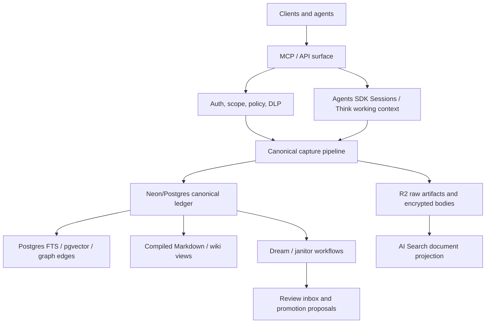

# Post-Hindsight Cloudflare + Open Brain Roadmap

Date: 2026-06-01
Status: Proposed execution roadmap
Scope: HAETSAL OS modernization, Hindsight removal, Cloudflare upgrade, and long-term open-brain foundation

## Supersession Note

This roadmap supersedes earlier planning wherever they conflict:

- `docs/implementation-plans/cloudflare-modernization-plan.md`
- `docs/implementation-plans/advanced-open-brain-implementation-plan.md`
- `docs/advanced-open-brain-architecture.md`

The important changes are:

1. Hindsight is no longer a target projection or semantic authority.
2. Neon/Postgres becomes the canonical memory substrate directly owned by HAETSAL.
3. Cloudflare Hyperdrive is the standard Worker-to-Neon path.
4. Cloudflare AI Search is adopted as a managed document retrieval projection, not as canonical memory.
5. GBrain contributes retrieval and dream-cycle design patterns, not its Git-first source-of-truth contract.
6. OB1 contributes governed memory semantics: evidence before instruction, review state, provenance, recall traces.
7. Schema Compute contributes only governance invariants: procedural gating, contradiction surfacing, janitor passes, and audit discipline.

## Executive Decision

Build HAETSAL as a Postgres-first open brain with Cloudflare as the runtime shell.

Canonical truth:

- Neon/Postgres: memory ledger, identities, scopes, events, claims, facts, entities, edges, reviews, policies, recall traces, session evidence.
- R2: encrypted raw bodies, source artifacts, generated exports, compiled Markdown artifacts.
- Markdown: source truth for user-authored narrative files and compiled/browsable views generated from the canonical ledger.

Non-canonical projections:

- Cloudflare AI Search: managed hybrid document retrieval over selected R2/document projections.
- Postgres pgvector/FTS: governed retrieval over canonical memory, facts, edges, claims, and source metadata.
- Durable Object / Agents Sessions: live conversation state, compaction, context blocks, and short-term working memory.
- D1: Cloudflare-local operational metadata only, not memory truth.
- Graphiti: deferred optional projection, not a core dependency.

## Target Shape

The product surface should hide engine details. Users and agents should call stable tools such as `capture_memory`, `search_memory`, `prepare_context_for_agent`, `trace_relationship`, `get_entity_timeline`, `review_memory`, and `memory_status`. Whether a result came from Postgres FTS, pgvector, AI Search, graph edges, or a compiled wiki page should be provenance, not interface complexity.

## Research Basis

Cloudflare references verified during planning:

- Hyperdrive + Neon: https://developers.cloudflare.com/workers/databases/third-party-integrations/neon/
- Hyperdrive Postgres driver guidance: https://developers.cloudflare.com/hyperdrive/configuration/connect-to-postgres/
- Agents Sessions: https://developers.cloudflare.com/agents/api-reference/sessions/
- Think: https://developers.cloudflare.com/agents/api-reference/think/
- Workflows for agents: https://developers.cloudflare.com/agents/concepts/workflows/
- AI Search overview: https://developers.cloudflare.com/ai-search/
- AI Search hybrid search: https://developers.cloudflare.com/ai-search/configuration/indexing/hybrid-search/
- AI Search reranking: https://developers.cloudflare.com/ai-search/configuration/reranking/
- Sandbox SDK: https://developers.cloudflare.com/sandbox/
- Dynamic Workers: https://developers.cloudflare.com/dynamic-workers/getting-started/
- Browser Run Human in the Loop: https://developers.cloudflare.com/browser-rendering/features/human-in-the-loop/

Design references inspected:

- GBrain: retrieval stack, graph traversal, source-aware ranking, dream cycle, Markdown-as-source-of-record model.
- OB1/Open Brain: governed agent memory, provenance, use policy, review state, wiki compiler pattern.
- Schema Compute: procedural gating, memory layers, contradiction/janitor discipline, audit posture.
- `cloudflare-workspace-agent`: modern Cloudflare Agents, Think, Workspace, Workflow, Sandbox, and R2 patterns.

## Non-Negotiable Principles

1. One canonical memory substrate. Neon/Postgres owns durable memory truth.
2. Everything else is a projection, cache, working context, or compiled view.
3. Hindsight is removed completely before adding another heavyweight memory engine.
4. Chat sessions become evidence, not automatic instructions.
5. Agent-written memory starts as evidence until promoted by policy or review.
6. Contradictions are preserved and surfaced, not smoothed into tidy prose by default.
7. Markdown remains valuable, but only in two explicit roles: user-authored source material and generated compiled views.
8. D1 never stores canonical memory content.
9. Procedural memory cannot be written directly by domain agents.
10. Each phase must leave the product in a testable, internally coherent state.

## Current-State Assessment

The current codebase still has Hindsight as a material runtime concern:

- `ARCHITECTURE.md` describes Hindsight containers and direct Neon access as the memory engine.
- `wrangler.toml` still carries Hindsight container/binding assumptions.
- `src/services/canonical-semantic-recall.ts` still routes semantic recall through Hindsight.
- `src/services/hindsight*.ts`, `src/cron/hindsight-*`, and Hindsight DO/container files remain in the tree.

The newer HAETSAL lineage also contains useful partial scaffolding:

- Canonical capture/pipeline/projection abstractions.
- Explicit graph query surfaces such as `trace_relationship` and `get_entity_timeline`.
- Graphiti projection mapping concepts.
- External client `brain-memory` rollout patterns.
- Chief-of-staff context builder concepts.

Before implementation, decide whether execution occurs in:

- `C:\Users\matth\Documents\HAETSAL OS`
- `C:\Users\matth\Documents\HAETSAL OS 11.4 deploy`

If the first is the active tree, port any newer canonical Postgres and compiled-synthesis work from the second before starting destructive Hindsight removal.

## Phase 0 - Baseline Reconciliation

Goal: choose the active working tree and produce a clean migration baseline.

Tasks:

- Compare `HAETSAL OS` and `HAETSAL OS 11.4 deploy` for canonical Postgres, Graphiti, compiled synthesis, package, Wrangler, and test differences.
- Choose one active repository for execution.
- Create a branch and preserve uncommitted user work.
- Run baseline checks: `npm test`, `npm run postflight`, and targeted memory tests.
- Inventory every Hindsight reference by category: config, binding, service, type, cron, route, test, docs.
- Inventory current Cloudflare bindings and classify them as adopt, keep, replace, or remove.

Acceptance:

- One active repo is chosen.
- Baseline test status is recorded.
- Hindsight removal inventory exists.
- No runtime behavior has changed.

## Phase 1 - Cloudflare Currency Foundation

Goal: update the Cloudflare runtime and dependencies before architectural rewiring.

Tasks:

- Update `wrangler` and `@cloudflare/workers-types` to current compatible versions.
- Update compatibility date after checking runtime impact.
- Add `nodejs_compat` for Postgres drivers and Hyperdrive.
- Upgrade `agents`, `@cloudflare/think`, `@cloudflare/ai-chat`, and `ai` in a controlled sequence.
- Replace retired or stale Workers AI model IDs with a model selector routed through AI Gateway.
- Preserve current MCP behavior while dependencies move.
- Document any breaking changes in a short impact note.

Acceptance:

- Tests pass after dependency and compatibility updates.
- MCP tools still register and respond.
- AI calls route through AI Gateway.
- No Hindsight removal has happened yet.

Risks:

- Agents SDK and Sessions APIs may have package churn.
- Compatibility date changes can expose runtime differences.

Mitigation:

- Update in small commits.
- Add smoke tests around MCP tool registration, Durable Object construction, and queue consumers.

## Phase 2 - Hyperdrive + Direct Neon Canonical Access

Goal: make HAETSAL, not Hindsight, the owner of canonical Neon/Postgres access.

Tasks:

- Create Hyperdrive binding(s) for Neon:
  - `HYPERDRIVE_CANONICAL` for normal canonical DB access.
  - Optional `HYPERDRIVE_FRESH` or explicit uncached path for freshness-critical reads if caching is enabled.
- Install and standardize on `pg` or `postgres.js` through Hyperdrive.
- Replace direct `@neondatabase/serverless` Worker usage where appropriate.
- Add a canonical DB adapter with:
  - transactions
  - typed query boundaries
  - schema verification
  - tenant/scope filters
  - test in-memory or local adapter
- Establish schemas for:
  - `events`
  - `sessions`
  - `messages`
  - `captures`
  - `artifacts`
  - `documents`
  - `chunks`
  - `entities`
  - `claims`
  - `facts`
  - `edges`
  - `reviews`
  - `policies`
  - `recall_traces`
  - `projection_jobs`
  - `compiled_documents`

Acceptance:

- HAETSAL can write and read canonical memory rows directly in Neon through Hyperdrive.
- D1 is not used for canonical memory content.
- R2 stores encrypted large bodies/artifacts.
- Canonical records can answer source, scope, author, provenance, and review status questions.

Risks:

- Hyperdrive caching can serve stale reads if used blindly.
- Migration design may accidentally duplicate existing D1 or Hindsight state.

Mitigation:

- Split write/fresh read paths from cacheable read paths.
- Treat D1 as operational metadata only.

## Phase 3 - Complete Hindsight Removal

Goal: remove Hindsight without introducing Graphiti or AI Search as a hidden replacement brain.

Tasks:

- Export or snapshot any Hindsight data that must be retained.
- Map Hindsight records back into canonical captures, documents, claims, facts, entities, and edges where possible.
- Remove Hindsight containers, DO bindings, vars, env types, service stubs, routes, cron jobs, tests, docs, and migrations from the active runtime.
- Replace Hindsight semantic recall with the new retrieval broker in Phase 5.
- Remove Hindsight operation tracking or convert it into generic projection-job tracking.
- Update `README.md`, `ARCHITECTURE.md`, `CONVENTIONS.md`, `MANIFEST.md`, and relevant docs.

Acceptance:

- `rg -n "Hindsight|hindsight|HINDSIGHT"` returns only historical docs or explicit migration notes.
- The app runs without Hindsight containers.
- Tests pass without Hindsight service stubs.
- No client writes directly to any projection engine.

Risks:

- Hidden runtime paths may still assume Hindsight operation semantics.
- Existing tests may encode Hindsight behavior as product behavior.

Mitigation:

- Keep compatibility shims only temporarily and name them as migration shims.
- Add a removal checklist and fail tests if active runtime references return.

## Phase 4 - Canonical Memory Write Path

Goal: turn every memory write into governed evidence first.

Tasks:

- Route `capture_memory`, source ingests, session summaries, and agent writebacks into the canonical event ledger.
- Add explicit memory classes:
  - raw source
  - episode
  - observation
  - claim
  - fact
  - preference
  - procedure
  - compiled view
- Add trust state:
  - evidence
  - inferred
  - user_confirmed
  - trusted_import
  - disputed
  - stale
  - superseded
  - rejected
- Add use policy:
  - can_use_as_evidence
  - can_use_as_instruction
  - requires_confirmation
  - do_not_inject_automatically
- Preserve source links, timestamps, author/agent identity, model/runtime, confidence, scope, and retention policy.
- Ensure session close summaries are captured as evidence, not instruction.

Acceptance:

- Agent-written memory cannot become instruction-grade without promotion.
- Procedural memory writes from domain agents are rejected or downgraded to review proposals.
- Every memory item has provenance and review status.
- Recall traces can explain what was retrieved and used.

Risks:

- Over-governance can make capture feel heavy.
- Under-governance poisons future agent behavior.

Mitigation:

- Keep writes cheap, but make promotion disciplined.
- Start with evidence-first defaults and a small review UI/inbox.

## Phase 5 - Retrieval Broker: GBrain Patterns + AI Search

Goal: build retrieval as context assembly, not just vector search.

Retrieval modes:

- `raw`: exact canonical source/document lookup from Postgres/R2.
- `lexical`: Postgres full-text search over canonical documents and claims.
- `semantic`: pgvector over governed memory and/or AI Search over document projections.
- `graph`: Postgres entity/edge traversal.
- `temporal`: timeline and valid-time queries.
- `compiled`: generated Markdown/wiki pages and context packs.
- `composed`: brokered bundle that merges modes with citations, source authority, and gaps.

Tasks:

- Implement deterministic intent routing similar to GBrain, but keep explicit caller override.
- Add title, alias, source-authority, scope, freshness, and trust-state boosts.
- Add citations and evidence contracts to every retrieval result.
- Add Postgres one-hop and two-hop graph traversal over canonical edges.
- Add AI Search projection for R2/document corpora where managed hybrid retrieval is useful.
- Use AI Search hybrid/RRF/reranking for document retrieval, not for canonical facts that need tight policy filtering.
- Add eval fixtures for named-thing retrieval, relationship queries, contradiction queries, and hard negatives.

Acceptance:

- `search_memory(mode = raw|lexical|semantic|graph|temporal|compiled|composed)` works through one stable surface.
- Results carry provenance, scope, trust state, and source authority.
- AI Search is rebuildable from canonical records and R2 artifacts.
- Postgres graph traversal works without Graphiti.
- Retrieval tests cover known failure modes.

Risks:

- AI Search may look like it replaces the retrieval broker.
- Graph traversal may be too shallow at first.

Mitigation:

- Keep AI Search behind the broker.
- Start with one-hop/two-hop graph traversal and add Graphiti only if evidence shows the need.

## Phase 6 - Dream / Janitor / Consolidation Loop

Goal: replace Hindsight reflection with an explicit HAETSAL-owned maintenance cycle.

Initial dream cycle:

1. Ingest audit: identify new evidence since last run.
2. Entity extraction: update people, projects, organizations, topics.
3. Edge extraction: create or update typed edges.
4. Contradiction detection: create contradiction candidates, not silent resolutions.
5. Supersession detection: propose `supersedes` and validity-window changes.
6. Promotion review: propose evidence-to-fact and repeated-correction-to-procedure changes.
7. Compiled view refresh: regenerate project/person/topic/context Markdown.
8. Retrieval health: run evals and hard-negative checks.
9. Gap discovery: surface missing context the system expected but could not find.

Tasks:

- Implement as Workflows + Queues, with cron as a trigger, not as a fragile long Worker request.
- Store outputs as reviewable proposals.
- Soft-delete or supersede; do not hard-delete by default.
- Make procedural promotion conservative: repeated evidence plus validation plus review.
- Generate a daily/weekly report: new facts, conflicts, stale items, high-value connections, gaps.

Acceptance:

- Dream cycle can run idempotently.
- Contradictions are visible in review, not silently resolved.
- Compiled Markdown views cite canonical sources.
- The system can explain why a memory was promoted, rejected, or superseded.

Risks:

- Overcomplication before enough memory volume exists.
- Bad extraction creating false edges.

Mitigation:

- Start with report-only mode.
- Promote only after review or strict deterministic thresholds.

## Phase 7 - Markdown / Wiki Compiler

Goal: merge Karpathy-style compiled understanding with database-first memory.

Tasks:

- Define Markdown source classes:
  - authored profile/priorities/person/project notes
  - imported Obsidian/Drive notes
  - generated compiled pages
  - review reports
- Snapshot authored Markdown into canonical captures with source hashes.
- Generate compiled Markdown from canonical data, never as untracked truth.
- Add frontmatter to generated pages with canonical IDs, source count, freshness, and review status.
- Make generated pages browsable in Obsidian/Drive, but read-only from HAETSAL's perspective.
- Add a regeneration command/job.

Acceptance:

- User-authored Markdown can be authoritative source material.
- Generated wiki pages can be deleted and rebuilt from canonical data.
- Compiled pages include contradiction sections and source truth.
- Wiki links can become candidate graph edges, but canonical Postgres edges remain authoritative.

Risks:

- Users may edit generated pages and expect truth to change.

Mitigation:

- Clearly mark generated pages as compiled.
- Add an import path for deliberate edits to become new authored source captures.

## Phase 8 - Agents SDK Sessions / Think Working Context

Goal: modernize chat/session handling while keeping sessions non-canonical.

Tasks:

- Use Agents Sessions or Think for conversation storage, context blocks, compaction, search, and recovery where appropriate.
- Decide whether Sessions use Durable Object SQLite or Postgres providers via Hyperdrive.
- Flow session messages and summaries into canonical Postgres as evidence events.
- Do not treat Session context blocks as durable truth.
- Add context assembly hooks so agents request prepared bundles from the retrieval broker.
- Keep per-session state, WebSocket coordination, and active TMK handling inside Durable Objects.

Acceptance:

- Active chat UX improves through Sessions/Think.
- Session history is captured into canonical evidence.
- Compaction does not destroy canonical provenance.
- Agents receive prepared context bundles rather than raw transcript piles.

Risks:

- Sessions could become a second memory system.

Mitigation:

- Enforce "Sessions are working context; Neon is truth" in code, docs, and tests.

## Phase 9 - Cloudflare Optional Primitives

Goal: adopt optional Cloudflare primitives only when they map to real HAETSAL needs.

Adopt now:

- Hyperdrive for Neon.
- AI Gateway for all model calls.
- Workflows and Queues for durable multi-step jobs.
- R2 for artifacts and archives.
- Durable Objects for live agents/session coordination.
- Browser Run for browser capture and human-in-the-loop flows.
- Service bindings for internal Worker-to-Worker calls.

Adopt selectively:

- AI Search for document/artifact retrieval projections.
- Sandbox SDK for secure code execution if HAETSAL needs agent-run code, analysis, or tool execution.

Defer:

- Containers, except for Sandbox or a deliberately chosen graph/runtime service.
- Graphiti, until canonical Postgres graph traversal proves insufficient.
- Dynamic Workers, until HAETSAL supports generated tools or tenant-defined extensions.
- Workers VPC / Cloudflare Mesh, unless private-network backend access becomes required beyond Hyperdrive/Neon.

Avoid:

- D1 as canonical memory.
- AI Search as source of truth.
- Sessions as memory truth.
- Containers as the default post-Hindsight replacement.

## Phase 10 - Observability, Security, and Operations

Goal: make the new system inspectable and recoverable.

Tasks:

- Route model calls through AI Gateway with tenant/request metadata.
- Add cost ledger writes from AI Gateway logs or response metadata.
- Add retrieval traces for every composed context bundle.
- Add dream-cycle reports and failure retries.
- Add projection rebuild jobs for AI Search and compiled Markdown.
- Add canary tests for:
  - capture
  - recall
  - graph traversal
  - contradiction surfacing
  - compiled page regeneration
  - session evidence capture
- Move secrets toward Cloudflare Secrets Store where appropriate.
- Preserve encryption boundaries and never place raw memory content in D1/KV/Analytics Engine.

Acceptance:

- Operators can answer: what was captured, where did it go, what was retrieved, why was it trusted, and what can be rebuilt?
- Rebuild procedures exist for AI Search, compiled Markdown, and derived graph/search indexes.
- Security tests confirm scope boundaries and no plaintext memory leaks into operational stores.

## Recommended Execution Order

Do not try to build the whole brain in one pass.

Recommended order:

1. Phase 0: choose active tree and baseline.
2. Phase 1: Cloudflare dependency/runtime currency.
3. Phase 2: Hyperdrive + direct Neon canonical adapter.
4. Phase 3: Hindsight removal.
5. Phase 4: canonical governed write path.
6. Phase 5: retrieval broker with AI Search projection.
7. Phase 6: report-only dream/janitor loop.
8. Phase 7: compiled Markdown/wiki views.
9. Phase 8: Sessions/Think working-context modernization.
10. Phase 9/10: optional primitives and operations hardening.

Parallelization:

- Phases 1 and 2 can partly overlap after baseline.
- Phase 5 AI Search projection can start once canonical documents exist.
- Phase 7 compiled Markdown can start after canonical source links and retrieval traces exist.
- Phase 8 Sessions work should wait until canonical evidence ingestion exists.

## First Execution Spec

The first implementation-ready spec should be:

`specs/active/10.0-post-hindsight-cloudflare-baseline.md`

Suggested scope:

- choose active repo
- produce Hindsight removal inventory
- produce Cloudflare binding/dependency inventory
- add Hyperdrive target config plan
- update docs to mark old Hindsight plans superseded
- no runtime code removal yet

Stop point:

- branch created
- baseline tests recorded
- current docs point to this roadmap
- next spec can safely implement Phase 1

## Acceptance Criteria For The Whole Roadmap

- Hindsight is absent from active runtime code and config.
- Neon/Postgres is the only canonical memory substrate.
- Hyperdrive is the standard Worker-to-Neon connection path.
- D1 stores operational metadata only.
- Chat sessions flow into Postgres as evidence events.
- Agent-written memories are not instruction-grade without promotion.
- Retrieval broker supports raw, lexical, semantic, graph, temporal, compiled, and composed reads.
- AI Search is used only as a rebuildable document retrieval projection.
- Dream/janitor workflows surface contradictions, stale facts, gap reports, and promotion proposals.
- Compiled Markdown/wiki pages are generated from canonical sources and cite source truth.
- Procedural memory is gated by consolidation/review.
- Tests cover capture, retrieval, graph traversal, contradiction handling, session evidence capture, and rebuild paths.

## Explicit Non-Goals

- Do not port Hindsight concepts by copying Hindsight code.
- Do not make Graphiti mandatory in the core architecture.
- Do not make AI Search or D1 canonical.
- Do not make Markdown the global source of truth for concurrent agent writes.
- Do not replace the whole current app with `cloudflare-workspace-agent`.
- Do not introduce Containers unless the phase has a concrete execution/runtime need.

## Open Decisions

1. Which local directory becomes the execution baseline?
2. Should canonical sessions use Agents DO SQLite first, or Postgres providers through Hyperdrive from day one?
3. Which document classes should be indexed in AI Search first?
4. Should authored Markdown live in Obsidian, Google Drive, repo files, or all three with distinct source IDs?
5. What is the minimum review UI for contradiction and promotion proposals?
6. What is the first useful dream report: daily personal brief, weekly memory health report, or per-project change report?

